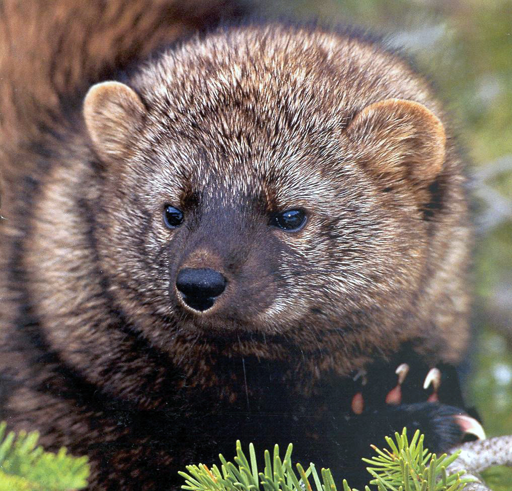
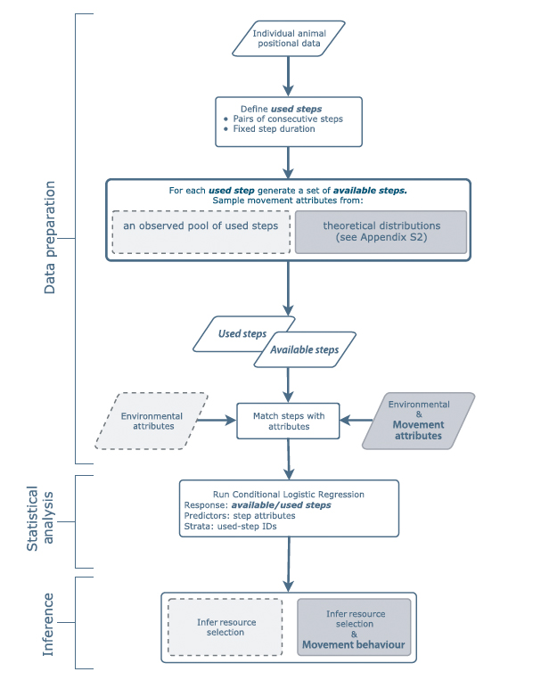
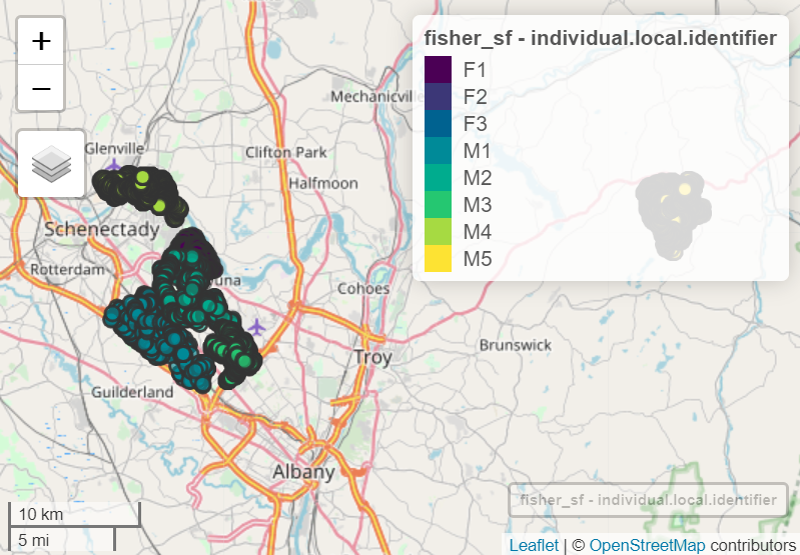

```{r setup, include=FALSE}
require(knitr)
knitr::opts_chunk$set(echo = TRUE, cache=TRUE, message = F)
r <- getOption("repos")
r["CRAN"] <- "https://ftp.osuosl.org/pub/cran/"
options(repos = r)
```

## Preliminaries: setting packages


```{r eval=TRUE, message=FALSE, results='hide',warning=FALSE}

#function to install and load required packages
ipak <- function(pkg){
  new.pkg <- pkg[!(pkg %in% installed.packages()[, "Package"])]
  if (length(new.pkg)) 
    install.packages(new.pkg, dependencies = TRUE)
  sapply(pkg, require, character.only = TRUE)
}


packages <- c("sf","terra","lubridate", "tidyverse","ggplot2","mapview","maptools","leaflet","xtable","broom","stars","magrittr","cowplot", "tmap","suncalc", "survival", "amt", "glmmTMB", "TMB")

#run function to install packages
ipak(packages)

```

A note about tidyverse.  Tidyverse is REALLY useful, but, sometimes has 'hidden' conflicts with other packages.  Check which specific conflicts there are with:
```{r}
tidyverse_conflicts()
```
Note especially this line:
```
amt::select()            masks raster::select(), dplyr::select()
```
Thus, for any tidyverse nesting and selecting, we need to specify dplyr::select(). 

# Lab 10 - Advanced Step Selection Function Models

In today lab we will continue to build skills modeling resource selection using movement-based statistical models. In particular, we will continue with the amt package for a case study of Fishers, and fit integrated step selection functions (iSSF) to individual and multiple individuals from a well known Fisher dataset.  Today's lab objectives are:

1) Fit an iSSF to a single Fisher dataset, estimating a clogit model, as well as then fitting the resultant movement and habitat kernels to field data.
2) Fit an iSSF to multiple individual Fishers. 
3) Explore mixed-effects cLogit models using the coxme and mcclogit packages.
4) Illustrate the recommended way to fit clogit models using glmmTMB based on Muff et al. (2020)

# Animal movement tools (amt)
Next, we will start using the amt:: R package for managing tracking data and conducting habitat selection analyses.

We will estimate a Step Selection Function, and, an integrated SSF to map the predictions of spatial distribution from the SSF based on the work of Tal Avgar et al's integrated Step Selection Function modeling approach.  This will be based on the examples provided in this paper by:

Singer, J., Fieberg, J. & Avgar, T. (2019) Animal movement tools (amt): R package for managing tracking data and conducting habitat selection analyses. Ecol Evol, 9, 880-890.https://doi.org/10.1002/ece3.4823 

based on this method:
  
  Avgar, T., Potts, J.R., Lewis, M.A., Boyce, M.S. & Börger, L. (2016) Integrated step selection analysis: bridging the gap between resource selection and animal movement. Methods in Ecology and Evolution, 7, 619-630. https://doi.org/10.1111/2041-210X.12528 

These data are from Fishers in upstate New York collected by a colleague, Scott La Point, during his PhD with Max Planck.  


To get started, we will review the handy Figure from Avgar et al. about the steps involved in fitting an integrated Step Selection Function from animal movement data.



Lets get started....
```{r warning=FALSE}
fisher <- read.csv("Data/Martes pennanti LaPoint New York.csv")
head(fisher)
str(fisher)
ggplot(fisher, aes(location.long, location.lat, colour = individual.local.identifier)) + geom_point()
```

Next, let's turn fisher into a sf data frame for use in raster operations later. First we need to remove NA's, which we can do here using complete.cases and which we do later using the filter(!is.na()) command.
```{r}
fisher1<-fisher[complete.cases(fisher[4:5]),]
fisher_sf <- st_as_sf(fisher1,
                      coords = c("location.long","location.lat"),
                      crs = "EPSG:4326")
```

```{r eval=FALSE}

mapview(fisher_sf, zcol="individual.local.identifier", legend = TRUE, cex=5, lwd=2, map.type = c("OpenStreetMap.DE", "Esri.WorldShadedRelief"))
```

What is always amazing to me is how urban these Fisher's are. Whereas in the west, Fishers tend to be more of a wilderness species. These are living in downtown urban center parks making a tidy living eating gray squirrels, I bet. 
Next we will bringing Fisher data from a single individual, ID 1016, Fisher M1 (known as "RickyT"), into a MOVE object.
```{r, warnings = F}
dat <- read_csv("Data/Martes pennanti LaPoint New York.csv") %>%
   filter(!is.na(`location-lat`)) %>%
   dplyr::select(x = `location-long`, y = `location-lat`,
           t = `timestamp`, id = `tag-local-identifier`) %>%
    filter(id %in% c(1465, 1466, 1072, 1078, 1016, 1469)) # for example 2
dat_1 <- dat %>% filter(id == 1016)
head(dat_1)
ggplot(dat_1, aes(x, y, colour = id)) + geom_point()
```

_From Singer et al. (2019)..._
The function amt::make_track creates a track (the basic building block of the amt package), given the names of the columns containing x and y coordinates, time (t), and we can set a coordinate reference system (CRS). The original data were provided in geographical coordinates (EPSG code: 4326). Here, we shall transform this original CRS (using function amt::transform _ coords).

We will make a track just with the data from RickyT. 

```{r, warning = F}
dat_R <- amt::make_track(dat_1, x, y, t, crs = 4326) %>%
     amt::transform_coords(3857)


amt::summarize_sampling_rate(dat_R)
```
_From Singer et al. (2019).._

We see that we have 8,957 total locations, the shortest interval between locations is 0.1 min and the largest time interval between locations is 1,208 min, with median interval length equal to roughly 2 min. Despite the 2 min temporal resolution, we choose to resample the track to 10 min with a tolerance of 1 min (amt::track_resample), to conduct the analyses on the same temporal scale as the next example (where most individuals had a median sampling rate of 10 min).

The function minutes from the package tidyverse and lubridate (Grolemund & Wickham, 2011), is used here to create an object of class Period that is then passed to amt::track_resample. Periods can be specified using all common time units; thus, it is straightforward to specify a sampling rate and an acceptable tolerance. We will also choose to keep only those bursts (subsets of the track with constant sampling rate, within the specified tolerance) with at least three relocations, the minimum required to calculate a turn angle amt::filter_min_n_burst). Note a burst is one set of consistent locations without a missed fix. 

The following code implements those choices and translates from a point representation to a step (step length, turn angle) representation of the data. In the final line of the code snippet, we use the function amt::time_of_day (a wrapper around maptools:: sunriset and maptools::crepuscule; Bivand & Lewin‐Koh, 2017) to calculate if a location was taken during the day or night. If the argument include.crepuscule is set to TRUE, the function not only considers day and night, but also dawn and dusk.
```{r}
stps <- amt::track_resample(dat_R, rate = minutes(10), tolerance = minutes(1)) %>%
  amt::filter_min_n_burst(min_n = 3) %>% amt::steps_by_burst() %>%
  amt::time_of_day(include.crepuscule = FALSE)

str(stps, width = 80, strict.width = "no", nchar.max = 80, give.attr = FALSE)
```

## Obtaining the NLCD data from `FedData`
Next, we will obtain the Landcover data from the National Landcover Database using the FedData pacakge. I encourage you to explore the FedData package here - they include several very handy spatial datasets including NLCD, Daymet, and national hydrography datasets. This is a VERY handy R package. 

See here https://cran.r-project.org/web/packages/FedData/FedData.pdf 
and
https://github.com/ropensci/FedData
and Kyle's website here:
https://www.bocinsky.io

The first set of commands are to create a blank raster that we can use as an extent to 'clip' the incoming NLCD data by. We also need to make the projection a PROJECTED, cartesian UTM NAD83 projection as that is what the NLCD are stored in. 

First, we have to install the R package `FedData` from github because of changes to NLCD file services which are now being delivered using a different web coverage service. 
```{r}
require("devtools")
devtools::install_github("ropensci/FedData")
library(FedData)
```

The key here is to remind yourself that the extent will have to be bigger than the actual extent of the Fisher data, because of the generation of availability samples during the SSF models.  Keep this in mind in your own research as well. For example, I had to go all the way back to the beginning and clip out a larger extent later.  
```{r, warning=F}
## Create a Mask Raster based on the extent of Fisher. Note that I made it arbitrarily larger. 
crs(fisher_sf, proj=TRUE)
fisher_sf2 <-st_transform(fisher_sf, crs = "EPSG:3857")
ext(fisher_sf2)
st_bbox(fisher_sf2)
mask.raster<-rast()
ext(mask.raster) <- c(xmin=-8240000, xmax=-8160000, ymin=5260000 , ymax=5295000)

res(mask.raster) = 30
crs(mask.raster)<- "+init=epsg:3857"  
#set all values of mask.raster to zero
mask.raster[]<-0
#projection(mask.raster)
plot(mask.raster)
plot(fisher_sf2, add = TRUE)
```
This confirms that our mask contains all the Fisher data, and, a buffer that is probably (?) large enough to contain all AVAILABLE samples created by the ssf available point generation method. This is a common rookie mistake. Always remember to buffer your used points. 

Next, we use the get_nlcd command to obtain 1 tile of the NLCD dataset based on our input mask.raster. The full command can be specified with options such as the location for the raw.dir, the extraction.dir, raster.options, and whether you want to 'overwrite'(force redo). For example, here:
```
get_nlcd(mask.raster, label="landuse", year = 2011, dataset = "landcover", raw.dir = "/Users/mark.hebblewhite/Box Sync/Teaching/UofMcourses/WILD562/Spring2021/Labs/Lab10/Data/raw/", extraction.dir = "/Users/mark.hebblewhite/Box Sync/Teaching/UofMcourses/WILD562/Spring2021/Labs/Lab10/2021/Fisher/extract/", raster.options = c("COMPRESS=DEFLATE", "ZLEVEL=9", "INTERLEAVE=BAND"), force.redo = F)
```

Note, here, I do create a directory on my local machine where to put the raw downloaded NLCD tiles and extractions. 
```{r, warning = F}
get_nlcd(mask.raster, label = "landuse", year = 2016, dataset = "landcover", extraction.dir = "Data/extract/", force.redo = TRUE)
land_use <- rast("Data/extract/landuse_NLCD_Land_Cover_2016.tif")
str(values(land_use))
head(land_use)
hist(values(land_use))
```


Like any landcover model, there are a number of categories, ~ 250 for the Conterminous United States (CONUS). In our upstate New York study area, we have 17. 

```{r}
unique(values(land_use))
rat <- as.data.frame(cats(land_use)) %>% 
  filter(!is.na(Class))
rat
levels(land_use)<-rat
```


Note that incoming NLCD data is the world web mercator projection `"+init=epsg:3857"` this caused no end of grief in this weeks lab.  Therefore, we will transform the fisherSP2 object to be in this same epsg projection to match the NLCD data using a comnination of the commands `st_transform()` and `st_crs()`. 
```{r, warning = F}
fisher_sf3 <-st_transform(fisher_sf2, st_crs(land_use)) 

tmap_mode("plot")
map <- tm_shape(land_use) +tm_raster(legend.show = FALSE)
map + tm_shape(fisher_sf3) +tm_dots()

plot(land_use)
plot(fisher_sf3, add=TRUE, type="p",cex=0.5)
```

Try adding a raster to our earlier mapview using + land_use. Note you get a bunch of error messages, and it takes a LONNG time.  But its a cool way to explore raster data in mapview. 
```
mapview(fisherSP3, zcol="individual.local.identifier", legend = TRUE, cex=5, lwd=2, map.type = c("OpenStreetMap.DE", "Esri.WorldShadedRelief")) + land_use
```

## Exploring Landcover for RickyT
_adapted from Singer et al._

We hypothesized that Fishers prefers forested wetlands over other landuse classes, based on previous work by Scott LaPoint. Armed with our NLCD landuse raster we create a layer called wet that is 1 for forested wetlands (category 90) and 0 otherwise using the terra packages.
```{r}
wet <- land_use == 90
names(wet) <- "wet"
#ext(wet) <- c(xmin=-8230000, xmax=-8210000, ymin=5270000, ymax=5280000)


##Lets zoom into Ricky T

rickyT.raster <- rast()
ext(rickyT.raster) <- c(xmin=1776730, xmax=1782940, ymin=2411165, ymax=2413945)
crs(rickyT.raster) <- "+proj=aea +lat_0=23 +lon_0=-96 +lat_1=29.5 +lat_2=45.5 +x_0=0 +y_0=0 +datum=NAD83 +units=m +no_defs"


plot(wet, ext = rickyT.raster)
plot(fisher_sf3,add=TRUE,  type="p", pch=12, cex = 0.5, ext = rickyT.raster)
```

Wow, Ricky surely seems to preferentially select 'wet' forests. For our first SSF we will focus just on this one covariate. 

## Exploratory Analyses of Step Lengths and Turning Angles

Before fitting our SSF, we will conduct some explortatory analyses of whether step lengtha and turning angles differ between wet and all other landcover models.  Our first step is to extract covariates for the start point of each step using the amt::extract_covariates() function. 

_from Singer et al_

Note that the function amt::extract _ covariates takes an argument where that indicates whether covariate values should be extracted at the beginning or the end of a step (“both” can be used to extract the covariate at the start and the end of a step). Depending on the target process under investigation (habitat selection or movement), covariates might be extracted at the end of the step (habitat selection process) or at the start of the step
(movement process). 

If covariates are extracted at the end of the step, they are typically included in the model as main effects, to answer questions of the type: How do covariates influence where the animal moves? 

In contrary, if covariates are extracted at the beginning of the step, they are typically included in the model as an interaction with movement characteristics (step length, log of the step length, or the cosine of the turn angle), to test hypotheses of the type: Do animals move faster/more directed, if they start in a given habitat? 

Finally, covariate values at the start and the end of a step can also be included in the model as an interaction with each other, to test hypotheses of the type: Are animals more likely to stay in a given habitat, if they are already in that habitat?

Here, we will.... 
```{r}
#wet_layer <- as(wet, "Raster")

dat1 <- amt::make_track(dat_1, x, y, t, crs = 4326) %>%
     amt::transform_coords(st_crs(wet))

stps <- amt::track_resample(dat1, rate = minutes(10), tolerance = minutes(1)) %>%
  amt::filter_min_n_burst(min_n = 3) %>% amt::steps_by_burst() %>%
  amt::time_of_day(include.crepuscule = FALSE)

eda1 <- stps %>% amt::extract_covariates(wet, where ="start") %>% 
  mutate(wet = if_else(wet == "TRUE", 1, 0)) %>% 
  mutate(landuse = factor(wet, levels = c(0, 1), labels = c("other", "forested wetland")))
head(eda1)
```

Next, we make some summary plots of step length, turning angle as a function of day/night, and wet and other landcover types. We bundle them together using the `cowplot` package.  
```{r}
p1 <- eda1 %>% dplyr::select(landuse, tod = tod_end_, sl_, ta_) %>%
  gather(key, val, -landuse, -tod) %>%
  filter(key == "sl_") %>%
  ggplot(., aes(val, group = tod, fill = tod)) + geom_density(alpha = 0.5) +
  facet_wrap(~ landuse, nrow = 2) +
  xlab("Step length [m]") + theme_light() +
  ylab("Density") +
  theme(legend.title = element_blank())

p2 <- eda1 %>% dplyr::select(landuse, tod = tod_end_, sl_, ta_) %>%
  gather(key, val, -landuse, -tod) %>%
  filter(key == "ta_") %>%
  ggplot(., aes(val, group = tod, fill = tod)) + geom_density(alpha = 0.5) +
  facet_wrap(~ landuse, nrow = 2) +
  xlab("Turn angle") + theme_light() +
  theme(legend.title = element_blank(),
  axis.title.y = element_blank())

pg1 <- plot_grid(
  p1 + theme(legend.position = "none"),
  p2 + theme(legend.position = "none"), rel_widths = c(1, 1))
leg <- get_legend(p1)
plot_grid(pg1, leg, rel_widths = c(1, 0.1))
```
If you want to save the figure, use this
```
#ggsave("Figures/fig_eda_1_animal.pdf", width = 20, height = 18, units = "cm")
```
This figure represents Exploratory data analysis of one individual fisher, Ricky T (id: 1016): empirical distributions of step lengths (first column) and turning angles (second column) are shown for forested wetland (second row) and other habitats (first row) and for day and night (colors). 

We note that the underlying gamma distributions for the step lengths vary by time of day, and, by landcover types such that it seems the Fisher moves further at night and especially in forested wetlands. Similarly, we see differences in the turning angles where there is much stronger directional persistence during the night in forested wetlands.  We will see the coefficients for these differences in the fitting of the SSF model. 

## Fitting a Step Selection Function

_From Singer et al._

To fit SSFs, the observed covariates associated with observed steps are compared to covariates associated with random (or control) steps. Random steps can be generated by either:
(a) sampling from the observed turn step‐length and turn angle distribution (resulting in a traditional SSF al la Fortin et al. 2005), or 
(b) by fitting a parametric distribution to the observed step lengths (either a negative‐exponential, a half-normal, a log‐normal, or a gamma; see Avgar et al., 2016, Appendix 2) and turn angles (a von Mises; Duchesne et al., 2015). 

As mentioned above, choosing b), an iSSF, is arguably less biased and also provides the user with a mechanistic movement model that can be used to simulate space use, and hence utilization distributions (Avgar et al., 2016; Signer et al., 2017). Currently, amt only implements the iSSFs with gamma and von Mises distributions. 

### amt::random_steps
Before we fit the ssf, we must first generate random steps using amt::random_steps(n=9) which choses 9 random points per Fisher location.  We then also extract covariates at the end points of each random step (the wet covariate here), and add time of day and the log of step length to each observation. We proceed by fitting a gamma distribution to the step
lengths and a von Mises distribution to the turn angles using maximum likelihood (Agostinelli & Lund, 2017; Delignette‐Muller & Dutang, 2015), and use these distributions to generate and pair nine random steps with each observed step. The number of random steps effects the estimation error; the more the steps, the lower the error, but the higher the computational burden (Avgar et al., 2016). 
```{r}
m1 <-stps %>% amt::random_steps(n = 9) %>%
  amt::extract_covariates(wet) %>%
  mutate(wet = if_else(wet == "TRUE", 1, 0)) %>% 
  amt::time_of_day(include.crepuscule = FALSE) %>%
  mutate(unique_step = paste(burst_,step_id_,sep="_")) %>% 
  mutate(log_sl_ = log(sl_)) -> d1
```
To see what the random_steps() function did, take a look at the first 18 rows. 
```{r}
head(m1, n=18)
#str(m1)
```
The target variable case_ is one for observed steps and zero for random (or control) steps. Each step is paired with several (here 9) control steps that form together a stratum (indicated by strat(step_id_) in the model formula). The function amt::random_steps automatically creates a new column, step_id_ , that identifies different strata.

Note that it is challenging to visualize the SSF point generation process, and at this point, we note that the x1_ y1_ and x2_ and y2_ for the 'random' cases. I have tried to visualize the random steps here, but I think because of the short duration, they do not seem as dramatic.  
```{r}
m1$caseF <-as.factor(m1$case_)
ggplot(m1, aes(x2_ ,y2_, colour = caseF)) + geom_point(aes(size = caseF, colour = caseF))
``` 

### Fitting SSF models using amt::fit_issf()

Next we fit 3 different statistical Step dplyr::selection Function models using the amt::fit_issf to fit a conditional logistic regression model to the resulting data including movement‐related covariates with the function amt::fit _ issf (a wrapper to survival::clogit; Therneau & Grambsch, 2000). 

We included three different combinations of different main effects, and their interactions, in 3 different SSF models below. These included the environmental covariate wet, the step length, and and the log of the step length (log_sl_ ) as modifiers of the shape parameter of the underlying gamma distribution. The estimated coefficient of sl_ and log_sl_ can be used to adjust the tentative shape estimate (i.e., the estimate of the shape parameter using the observed step lengths) of the underlaying gamma distribution for the step lengths. We also include interactions between wet and tod_ ,a factor with two levels—day (the reference category) and night, and between tod_ and log_sl_ .These interactions are included to the test the hypotheses that habitat dplyr::selection and displacement rate, respectively, differ between day and night.

We could have also included cosines of the turning angles and their interaction with day. This choice would modify the concentration parameter of the underlying von Mises distribution for the turning angles and allow the degree of directional persistence to depend on time of day; the data summarized in Figure 1 suggest that this could be a sensible
choice. For the sake of simplicity, however, we have assumed we have correctly modeled the degree of directional persistence and that it does not differ between day and night.

```{r}
m3 <- d1 %>% amt::fit_issf(case_ ~ wet + sl_ + wet:tod_end_+ sl_:tod_end_ +strata(unique_step))
m2 <- d1 %>% amt::fit_issf(case_ ~ wet + log_sl_ + wet:tod_end_+ log_sl_:tod_end_ + strata(unique_step))
m1 <- d1 %>% amt::fit_issf(case_ ~ wet + log_sl_ + sl_ + wet:tod_end_+ log_sl_:tod_end_ + sl_:tod_end_ + strata(unique_step))
```
Model 3 represents the habitat hypothesis that Fisher resource dplyr::selection differs for wet forests, and, differs between day and night (represented by the interaction between wet:tod_end_).  Movement hypotheses addressed as that step lenghts also differ between times of day, for example.  Here, the absolute step length, sl_, is modeled. 

Model 2 represents a similar hypothesis, but instead, with the log of step length. Finally, Model 1 includes both the untransformed step length and the log of step length. 

### Model Selection
We can conduct model dplyr::selection using AIC on these 3 models. First, I note however, that the Log-Likelihood for a conditional logistic regression model is not directly comparable to that of a traditional logistic regression model. So we cannot test, using AIC, whether conditioning on availability at every time step 'improves' model fit relative to a 'naive' logistic regression model. We will demonstrate this below when we explore mixed-effects SSF models. 
```{r}
AIC(m1$model, m2$model, m3$model)
```
So clearly, model1 is a bit better than model 2 and 3. Lets look at Model 1, and summarize/extract the coefficients.
```{r}
summary(m1)
s <- summary(m1$model)$coefficients
s
```
_from Singer et al. 2019_
Inspecting the fitted model, we make the following observations: 
(a) There is evidence to suggest that the animal prefers forested wetlands over other landuse classes, 
(b) there is no difference in RickyT's preference for wetlands between day and night, 
(c) there is evidence to modify the shape of the gamma distribution fit to the observed step lengths (through the log of the step length), and 
(d) the modification of the shape parameter should be done separately for day and night, indicating that expected movement speeds differ between day and night.

### Examining Movement Statistics

Besides inspecting the coefficients and their standard errors, we can calculate movement statistics and examine the turning angle.  We begin by retrieving the tentative parameter estimates (i.e., the estimated parameters before correcting for habitat dplyr::selection; see Avgar et al. (2016) for more details) for the gamma distribution of the step‐length distribution:
```{r}
coef(m1)
plot_sl(m1)
sl_m1<-sl_distr(m1)
## note we will extract the scale and shape parameters of the gamma distribution for later simulating the UD
scale <- sl_m1$params$scale
shape <- sl_m1$params$shape
```
Note that these scale and shape parameters are for the intercet step length distribution for the model, which is during the DAY. See the coef(m1) output above for a reminder, and the figure we made above. 

```{r}
ggplot(d1, aes(tod_end_, sl_)) +geom_violin()
sl_data <- as_tibble(d1)
sl_data %>% group_by(tod_end_) %>% summarize(median = median(sl_))
```
Note the interpretation here is that at night, fishers move ~ 105m per step length, 7 meters further than during the day.  

## Simulating the Utilization Distributions 

In a final step, we simulated space‐use from the fitted model m1 to obtain a model‐based estimate of the animal's utilization distribution (UD; Avgar et al., 2016; Signer et al., 2017). Generally, two types of UDs can be simulated: the transient UD and the steady‐state UD. The transient UD describes the expected space‐use distribution of the animal within a short time period and is hence conditional on the starting position. The steady‐state UD describes the expected space‐use distribution of the animal in the long‐term. In order to simulate UDs, one has to ensure that the animals stay within the study domain. 

We see three possible methods for achieving this goal–all implemented in amt: 
(a) use a covariate that attracts the animal toward one or more centers of activity (e.g., the squared distance to the mean of all coordinates), 
(b) use a very large landscape, or 
(c) use a wrapped landscape (torus). 

Here, we illustrate the simulation of steady‐state and transient UDs. For the steady‐state UD, we simulate from the first observed location 107 time steps on a toroid landscape,
once for day and once for night. For the transient UD, we are interested in the UD up to 10 hr after last observation, we therefore simulated 72 steps (at a 10 min sampling rate) 5 × 103 times. 

First, we crop out wet for a smaller area around just Ricky T using the amt::bbox() function which describes a bounding box. 
```{r, warning = F}
wet_c <- crop(wet, amt::bbox(dat1, spatial = TRUE, buff = 1e3))
```
First, we recall that since we have different model coefficients for day and night, we need to fit the movement and habitat kernels for day and night. 

Thus, we estimte the daytime movement kernel using the amt::movement_kernel(). This calculates a movement kernel from a fitted (i)SSF. The method is currently only implemented for the gamma distribution. Note, we use the tentative scale estimate and the shape estimate
adjusted for day.
```{r eval = FALSE}
mk <- amt::movement_kernel(scale, shape, wet_c)
plot(mk)
```

Second, we estimate the habitat kernel which is calculated more or less like a traditional RSF model by multiplying resources with their corresponding coefficients from the fitted (i)SSF. That is for each pixel we calculate the estimated dplyr::selection coefficients times the resources and exponentiate the product. 
```{r eval = FALSE}
#wet_c_rast <- as(wet_c, "Raster") #habitat_kernel needs the resource argument to be a raster layer or raster stack (wet_c is a formal class SpatRaster from terra)
hk <- amt::habitat_kernel(list(wet = coef(m1)["wet"]), wet_c)
plot(hk)
```

Next, we fit the simulated steady-state UD based on the movement model embedded within the SSF using amt:: simulate_ud(), which simulates a utilization distribution (UD) from a fitted Step-dplyr::selection Function. We time it because we are into that sort of thing.
```{r eval = FALSE}
system.time(ssud_day <- amt::simulate_ud(
  mk, hk,
  as.numeric(stps[1, c("x1_", "y1_")]),
   n = 1e7))
 plot(ssud_day)
```

Finally, we simulate the transient UD which is based on some starting location and duration (72 steps here) using the amt:simulate_tud(). This is a conviencience wrapper arround simulate_ud to simulate transition UDs (i.e., starting at the same position many times and only simulate for a short time). In order to simulate the transient UD we have to repeatedly simulate short tracks starting at the same point, and then sum individual UDs and normalize, which we do with the function amt::simulate _ tud.
```{r eval = FALSE}
system.time(tud_day <- amt::simulate_tud(mk, hk, as.numeric(stps[150, c("x1_", "y1_")]), n = 72, n_rep = 5e3))
plot(tud_day)
```

And finally, we bundle them together in a nice figure
```{r eval = FALSE}
pllog <- list(
  geom_raster(),
   coord_equal(),
  scale_fill_continuous(low = "white", high = "red", tran = "log10", na.value = "white"),
   scale_y_continuous(expand = c(0, 0)),
   scale_x_continuous(expand = c(0, 0)),
   theme_light(),
   theme(legend.position = "none"))

 pl <- list(
   geom_raster(),
   coord_equal(),
   scale_fill_continuous(low = "white", high = "red", na.value = "white"),
 scale_y_continuous(expand = c(0, 0)),
   scale_x_continuous(expand = c(0, 0)),
   theme_light(),
   theme(legend.position = "none"))

r1 <- as.data.frame(st_as_stars(mk)) #converting raster mk to a stars object to get x and y coordinates
p1 <- ggplot(r1, aes(x, y, fill = d)) + pllog + ggtitle("Movement kernel (day)")


r2 <- as.data.frame(st_as_stars(hk))
p2 <- ggplot(r2, aes(x, y, fill = layer)) + pl + ggtitle("Habitat kernel (day)")

r1 <- as.data.frame(st_as_stars(tud_day))
 p3 <- ggplot(r1, aes(x, y, fill = layer)) + pllog + ggtitle("Transient UD (day)")

r1 <- as.data.frame(st_as_stars(ssud_day))
p5 <- ggplot(r1, aes(x, y, fill = layer)) + pl + ggtitle("Steady state UD (day)")

cowplot::plot_grid(p1, p2, p3, p5, ncol = 2, labels = "AUTO")
```

This figure shows Simulated utilization distributions for 1 fisher, RickyT, during the DAY. To obtain simulated Utilization Distributions (UD), a movement kernel (panel a) and a habitat kernel (panel b) are needed. The movement kernel is always placed at the current position of the animal. The next step of the animal is then sampled with probability proportional to the product of two kernels. Expected differences in movement speeds between night and day are reflected in the transient UD (panels c and e) and to a lesser extend in steady‐state UD (panels d and f). Note, for better visualization, fills were log10 transformed for panels a, c, and e

Note that the transient UD's are slightly different from the paper because I started in a slightly different starting location. 

Finally, if we wanted to save them all:
```
ggsave("fig_one_animal1.pdf", height = 20, width = 24, units = "cm")
```

Also note that the paper in Ecology and Evolution shows calculation of the UD's during the night, which I have not been able to reproduce here because the `amt` package no longer has the adjust_shape() function. Welcome to the cutting edge if you want to learn how to adjust movement parameters.  I can think of dividing the data into two subsets, day and night. 

# Fitting SSF Models to Multiple Animals

We will conduct two-stage modeling of SSF's fit to individual Fishers in the same study area. 

We start again with the same data set (dat), containing data from six individual fishers. This time we are interested in quantifying among‐animal variability in the dplyr::selection coefficients. We proceed using nearly all the same steps as in the first example, but with a different data structure: data_ frames with list columns (Müller & Wickham, 2018). List columns are best thought of as regular columns of a data_ frame that are R lists and can contain any objects (in our case tracks and fitted models). The purrr::nest command can be used to nest data into a list column (Henry & Wickham, 2017).

```{r, warning = F}
dat <- read_csv("Data/Martes pennanti LaPoint New York.csv") %>%
 filter(!is.na(`location-lat`)) %>%
  dplyr::select(x = `location-long`, y = `location-lat`,
              t = `timestamp`, id = `tag-local-identifier`) %>%
   filter(id %in% c(1465, 1466, 1072, 1078, 1016, 1469))

 dat_all <- dat %>% nest(-id)
dat_all$sex <- c("f", "f", "f", "m", "m", "m")
dat_all
```
dat_all is now a nested data frame with 6 rows (one for each individual) and two columns. In the first column the animal id is given, and in the second column (by default named data) the relocations of the corresponding animal are saved.

We can now apply the steps as before for all animals. We first create a track for each animal and transform the coordinate reference system using the function amt::transform _ coords.
```{r,warning = F}
 dat_all <- dat_all %>%
  mutate(trk = map(data, function(d) {
     amt::make_track(d, x, y, t, crs = 4326) %>%
       amt::transform_coords(st_crs(land_use))}))
```
And summarize sampling rate
```{r}
dat_all %>% mutate(sr = lapply(trk, summarize_sampling_rate)) %>%
  dplyr::select(id, sr) %>% unnest(cols = c(sr))
```
This time we see that some individuals have a 2 min sample rate and others a 10 min one. Thus, we decided to resample the tracks to the same sampling rate of 10 min (noting that (i)SSF inference is scale dependent; Signer et al., 2017) using amt::track_resample.

## NLCD Extraction
Next, we are going to test for SSF as a function of 4 different landcover types now, more than just the wet forests. So we will create a reclassification matrix that lumps everything into 5 categories, with water/wet forests as the reference catetgory: water and wetland forests, developed open spaces, other developed areas, forests and shrubs, and crops. 

First, we remind ourselves of the Raster Attribute Table (RAT) we created above.
```{r}
rat

rcl <- cbind(c(11, 12, 21:24, 31, 41:43, 51:52, 71:74, 81:82, 90, 95),c(1, 1, 2, 3, 3, 3, 2, 5, 5, 5, 5, 5, 5, 5, 5, 5, 8, 8, 1, 1))
# water, dev open, dev, barren, forest, shrub and herb, crops, wetlands
# 1: water, wetlands
# 2: developed (open)
# 3: developed (other)
# 5: forest, herbaceous
 # 8: crops
lu <- classify(land_use, rcl, right = NA)
names(lu) <- "landuse"
plot(lu)
plot(fisher_sf3, add=TRUE)
```

Next, we resample the tracks from 6 individual fishers to 10 minute steps, filter them into consecutive bursts of 3 or more 10 minute locations, create random steps (which by default goes back to the last setting used, which was n=9), extract covariate values from both the start and the end, and convert the landuse covariate to a factor all in one step.
```{r, warning = F}
#lu2 <- as(lu, "Raster") #changing SpatRaster object lu into a Raster Layer for use in the command amt::extract_covariates which requires a raster layer

 m1 <- dat_all %>%
   mutate(steps = map(trk, function(x) {
     x %>% amt::track_resample(rate = minutes(10), tolerance = seconds(120)) %>%
      amt::filter_min_n_burst() %>%
       amt::steps_by_burst() %>% amt::random_steps() %>%
       amt::extract_covariates(lu, where = "both") %>% 
       mutate(unique_step = paste(burst_,step_id_,sep="_")) %>% 
       mutate(landuse_end = factor(landuse_end))
     }))

```
Note we got some NaNs produced errors - 12 of them to be precise.  We'd have to dig into exactly why, but I would not be TOO concerned in such a big dataset.  But - my guess is its because some available locations ended off the map. 

We then fit a simple SSF model to each individual. The main difference to the previous example here, is that the all the steps from above are wrapped into one mutate call. This call creates a new column to dat _ all called ssf. This is a list column and each entry in this column contains a fitted SSF. 
```{r}
m4 <- m1 %>% mutate(fit = map(steps, ~ amt::fit_issf(., case_ ~ landuse_end +
                                                           strata(unique_step))))
m4
```

m4 is still a data frame with one new column: ssf that is again a list column with a fitted SSF. Lets look at 1 of these models for individual 1
```{r}
m4$fit[[1]]$model
```

Lets look at the marginal, population level averaged coefficient for landuse across our individual animals. 
```{r}
d2 <- m4 %>% mutate(coef = map(fit, ~ broom::tidy(.x$model))) %>%
   dplyr::select(id, sex, coef) %>% unnest(cols = coef) %>%
  mutate(id = factor(id)) %>% group_by(term) %>%
  summarize(
     mean = mean(estimate),
    ymin = mean - 1.96 * sd(estimate),
     ymax = mean + 1.96 * sd(estimate))

d2$x <- 1:nrow(d2)
d2
```
Finally, we make some fancy figures
```{r}
p1 <- m4 %>% mutate(coef = map(fit, ~ broom::tidy(.x$model, conf.int = T))) %>%
  dplyr::select(id, sex, coef) %>% 
  unnest(cols = coef) %>% 
  mutate(id = factor(id)) %>%
  ggplot(., aes(x = term, y = estimate, group = id, col = id, pch = sex)) +
  geom_rect(mapping = aes(xmin = x - .4, xmax = x + .4, ymin = ymin, ymax = ymax), data = d2, inherit.aes = FALSE,fill = "grey90") +
  geom_segment(mapping = aes(x = x - .4, xend = x + .4,y = mean, yend = mean), data = d2, inherit.aes = FALSE, size = 1) +
  geom_pointrange(aes(ymin = conf.low, ymax = conf.high), position = position_dodge(width = 0.7), size = 0.8) + 
  geom_hline(yintercept = 0, lty = 2) +
  labs(x = "Habitat", y = "Relative selection Strength") + theme_light() +
  scale_x_discrete(labels = c("Dev(open)", "Dev(other)", "Natural", "Crops"))

p1
```
From here, it is easy to investigate coefficients for several animals and look at population‐level effects. The results suggest that there are some general population‐level trends. All fishers seem to prefer wetland forests and natural areas relative to developed areas (of either type), whereas considerable among‐animal variability in the coefficients for crops makes it difficult to draw firm conclusions about this landuse type. Lastly, there seems to be little differentiation based on sex.

And again, if we want to save we use:
```
ggsave("img/fig_all_animals.pdf", width = 24, height = 12, units = "cm")
```

# Mixed-effect cLogit Models

In the next set of exercises, I will build on the SSF case study of Singer et al., and conduct mixed-effects clogit analyses accounting for individual fishers as random effects similar to Lab 7.  Conceptually, adding random effects to conditional logistic regression models was challenging because there is no intercept.  Here are the first 2 papers that figured out how to add a random intercept for each individual animal (e.g.), however, it did so in MATLAB. So, its mostly inaccessible to biologists. 

  Craiu, R. V., T. Duchesne, D. Fortin, and S. Baillargeon. 2011. Conditional Logistic Regression With Longitudinal Follow-up and Individual-Level Random Coefficients: A Stable and Efficient Two-Step Estimation Method. Journal of Computational and Graphical Statistics 20:767-784.

  Duchesne, T., D. Fortin, and N. Courbin. 2010. Mixed conditional logistic regression for habitat dplyr::selection studies. Journal of Animal Ecology 79:548-555.

Since these initial papers, however, there have been a few big breakthrough’s lately with the mclogit package http://cran.r-project.org/web/packages/mclogit/mclogit.pdf  or the coxme package here http://cran.r-project.org/web/packages/coxme/coxme.pdf I just played around with both of these packages and they are actually. 

We will first need to 'unpack' the nested data frame from section 3 above into an expanded dataframe using the unnest command.  Then we will progress through a set of 3-4 different models and compare model interpretations to naive GLM models of the same kind. 
```{r}
fisher6 <- dat_all %>%
  mutate(steps = map(trk, function(x) {
    x %>% amt::track_resample(rate = minutes(10), tolerance = seconds(120)) %>%
      amt::filter_min_n_burst() %>%
      amt::steps_by_burst() %>% amt::random_steps() %>%
      amt::extract_covariates(lu, where = "both") %>%
      mutate(unique_step = paste(burst_,step_id_,sep="_")) %>% 
      mutate(landuse_end = factor(landuse_end))
  })) %>%
  dplyr::select(id, steps) %>%
  unnest()

fisher6
```


Next, we will add a String variable for landuse_end recalling that, earlier, we defined the NLCD landcover according to:
  1: water, wetlands
  2: developed (open)
  3: developed (other)
  5: forest, herbaceouse
  8: crops
```{r}
head(fisher6$landuse_end)
fisher6$landuseName = ifelse(fisher6$landuse_end == 1, "Wet Forests", 
                             ifelse(fisher6$landuse_end == 2, "Developed Open", 
                             ifelse(fisher6$landuse_end == 3, "Developed Other", 
                             ifelse(fisher6$landuse_end == 5, "Natural", "Crops"))))
table(fisher6$landuseName, fisher6$landuse_end)
```

## Fit a naive GLM
First, we will fit a 'naive' GLM only focusing on the habitat processes, that is, habitat dplyr::selection for the landcover covaraites and compare them to the coefficients from the SSF fit to each individual Fisher and their two-stage population-level averages. 
```{r}
model1 <- glm(case_~ I(landuse_end), data=fisher6,family=binomial(link="logit"))
## I commented out these next few versions of the models fit to landuseName to make comparisons to the previously fit 6 fisher two-step models more comparable, though we have to then keep track of which landovers 2, 3, 5, and 8 are. 
#model1 <- glm(case_~ I(landuseName), data=fisher6,family=binomial(link="logit"))
#model1 <- glm(case_~ I(landuseName=="Developed Open") + I(landuseName=="Developed Other") +I(landuseName=="Natural")+I(landuseName=="Crops"), data=fisher6,family=binomial(link="logit"))
summary(model1)
```
This model gives us an intercept, which is interpreted as wet-forests, and we note that we also did not get an intercept in the SSF model above.  Lets now compare the coefficients to above:
```{r}
coef(model1)
naive_glm <- broom::tidy(model1) %>% 
  filter(!term=="(Intercept)") 

figNaive <- naive_glm %>%
  ggplot(., aes(x = term, y = estimate)) +
  geom_pointrange(aes(ymin = estimate - 1.96*std.error, ymax = estimate +1.96*std.error)) +
  labs(x = "Habitat", y = "Relative selection Strength") + 
    theme_light() +
  scale_x_discrete(labels = c("Dev(open)", "Dev(other)", "Natural", "Crops")) + geom_hline(yintercept = 0, lty = 2) + ylim(c(-3.75,1.5))
figNaive
```
First, we recall we are comparing the two-stage averaged SSF coefficients from the fisher SSF model above extracted in the object d2. This is simply the arithmetic mean of the 6 individual coefficients.  Second, note that the ORDER of landcover categories on the X axis are changed now, which is slightly annoying, and tough to remedy. But keep that in mind when looking at the next figure. 

```{r}
fig5 <- plot_grid(p1, figNaive)
fig5
```

We note that there are some similarities between coefficients, but, differences. 

  Developed Open is   -0.49 from the Naive Logit, and   -1.00 from the SSF
  Developed Other is  -1.82 from the Naive Logit, and   -2.20 from the SSF
  Natural is          +0.033 from the Naive Logit, and  +0.044 from the SSF
  CropsDeveloped Open -0.25 from the Naive Logit, and   -0.69 from the SSF

The difference in the interpretation from the different parameters highlights the 'effect' of movement, so to speak, on selection for covariates. Again, here, note we are not considering any differences between male or female, or night or day.  For example, one could conclude that the biggest difference is in the dplyr::selection of Developed Open, which we woudl underestimate the avoidance of if we failed to consider the movement processes. 

## Fitting a 'Naive' cLogit Model 

Next, we will fit a 'naive' clogit model, that is, a model that does not account for any differences between individuals and treats all step_id_'s as independent. Basically ignoring any random effects structure of individual fishers in this case. 
_from https://rdrr.io/cran/survival/man/clogit.html_ 
It turns out that the loglikelihood for a conditional logistic regression model = loglik from a Cox model with a particular data structure. Proving this is a nice homework exercise for a PhD statistics class; not too hard, but the fact that it is true is surprising.


```{r}
clogit1 <- clogit(case_ ~ I(landuse_end) + strata(unique_step), data = fisher6)
#clogit1 <- clogit(case_ ~ I(landuseName=="Developed Open") + I(landuseName=="Developed Other") +I(landuseName=="Natural")+I(landuseName=="Crops") + strata(stratum), data = fisher6)
summary(clogit1)
coef(clogit1)
# tidy up coefficients
clogit_1 <- broom::tidy(clogit1) %>% 
  filter(!term=="(Intercept)") 
## make a figure
figclogit1 <- clogit_1 %>%
  ggplot(., aes(x = term, y = estimate)) +
  geom_pointrange(aes(ymin = estimate+ 1.96*std.error, ymax = estimate-1.96*std.error)) +
  labs(x = "Habitat", y = "Relative selection Strength") + 
    theme_light() +
  scale_x_discrete(labels = c("Dev(open)", "Dev(other)", "Natural", "Crops")) + geom_hline(yintercept = 0, lty = 2) + ylim(c(-3.75,1.5))
plot_grid(p1, figclogit1)
```

The coefficients are a bit different, but still, quite close even with the cluster for each individual Stratum. 

## Mixed-effect cLogit Models with `coxme`

We can currently fit mixed-effects clogit models using `coxme`. We will use the `coxme` package to fit a mixed-effects conditional logistic regression model, accounting for the random effect of individual Fisher ID in this case. First, we ensure we have the `coxme` package loaded. See here for more information: https://cran.r-project.org/web/packages/coxme/vignettes/coxme.pdf 
```{r}
require(coxme)
```
There is no 'convenient' wrapper around the `coxme(Surv())` function like in clogit above.  Thus, first, we need to make a 'fake' time variable to trick the Cox-proportional hazards model that time is irrelevant in your conditional logistic model. We do this by adding a new variable, time_ to the fisher6 data frame above. This is actually what the clogit wrapper around survival is doing, we just don't know it. 
```{r}
fisher6$time_ <- ifelse(fisher6$case_ == 0, 2, 1)   #2 for control, 1 for case
table(fisher6$time_, fisher6$case_)
head(fisher6)
clogitM1<- coxme(Surv(time_,case_) ~ I(landuse_end) + strata(unique_step) + (1|id), data=fisher6)
AIC(clogitM1)
summary(clogitM1)

#clogitM2<- coxme(Surv(time_,case_) ~ I(landuse_end) + strata(stratum) + (1|id) +(I(landuseName=="Developed Other")|id) , data=fisher6)
#summary(clogitM2)
```

We note, importantly, that the random effects variance is quite low, nearly zero. This means there is very little variation between individual Fishers in selection.  This becomes important later. Moreover this is very similar to the take home message of Muff et al. (2020) that using just a random intercept in fitting any RSF or SSF model tends to underestimate the variance components due to the random intercept or random coefficients. We will see this below when we fit the same model with `glmmTMB1` 

Second, note, that I tried to fit a similar model using the `mclogit` package. However, the current implementation of random effects is limited to the PQL technique, which requires large cluster sizes. Thus, here, we do not have large enough clusters with only 9 random points. We see an error message accordingly. Therefore, I have suppressed the evaluation of the following R code but leave it in for your information if mcclogit seems useful in the future.  The basic call of the mclogit package requires a column that contains the choice counts or choice indicators (alternative is chosen=1, is not chosen=0). The second column contains unique numbers for each choice set. So then the model I tried to run, but failed, was:

```
mclogitTest2 <- mclogit(cbind(used_, unique_step) ~I(landuse_end), random=~ 1|id, data=fisher6)
```

Plotting the coefficients from `coxme` are more difficult because there is no tidy approach for objects generated by coxme models, but we can quickly compare the coefficients directly here, where column 1, 2, and 3 are the naive GLM, naive clogit, and mixed-effect cLogit models. And compare them to the coefficients for the two-step models from Singer et al. 
```{r}
v1<-model1$coefficients[2:5]
v2<-coef(clogit1)
v3<-coef(clogitM1)
v4<-d2$mean # note that this has female and male two-stage parameter estimates averaged. 
coefSum <- as.data.frame(cbind(v1, v2, v3, v4))
names(coefSum) <- c("Naive", "clogit", "coxme", "two-stage iSSF")
head(coefSum) # 

```
Recall that landuse_end 2, 3, 5 and 8 correspond to developed (open), developed (other), natural, and cropland. And that the forested wet areas are the 'reference' category. 

We note that there are some important differences here between the 'naive' , clogit/coxme, and  two-stage iSSF model. The reason why there are few differences between clogit, the coxme or mcclogit is because of the rather low variance in the summary of clogitM1 for individual Fisher's we saw above. 

However, there are - just like Lab 7 - differences between the two-staged model, d2, and the coxme/clogit models for landcover types 3 and 5, in particular.  

## Model Selection
```{r}
AIC(model1, clogit1, clogitM1)
```
This clearly confirms that really, the mixed-effect model structure is not necessary and we are fine making inferences using the 'naive' cLogit Model. Finally, we should compare manually the sum of the individual model AIC values from the two-stage modeling to really undestand if this clogit model is better than the two-step. However, these results may be idiosyncratically dependent on the small sample size of Fisher's here, 6, and the limited variation in response to just one categorical covariate.  Often, addition of mixed-effects models improves model fit substantially. 

## Fitting iSSF models with glmmTMB

Next we will review the Step Selection Function section of Muff et al. (2020) and follow their advice to fit SSF models using glmmTMB with a Poisson distribution and random coefficients at the individual level. This explains in part our noted lack of variance in the random intercepts for individuals above for the `coxme` models.  

Recall:
Muff, S., J. Signer, and J. Fieberg. 2020. Accounting for individual-specific variation in habitat-selection studies: Efficient estimation of mixed-effects models using Bayesian or frequentist computation. Journal of Animal Ecology 89:80-92.https://doi.org/10.1111/1365-2656.13087 

```{r}
head(fisher6)
table(fisher6$landuse_end)
TMBm1 <- glmmTMB(case_~ I(landuse_end) + (1|step_id_) + (0 + I(landuse_end)|id), family = poisson, data = fisher6, doFit = FALSE)

TMBm1$parameters$theta[1] <-log(1e3)

TMBm1$mapArg <-list(theta=factor(c(NA, 1:15)))
glmm.TMB.random <- glmmTMB::fitTMB(TMBm1)
summary(glmm.TMB.random)
```
Note that we get an error about model convergence problems with a non-positive-definitive Hessian Matrix.  See here for more details: https://cran.r-project.org/web/packages/glmmTMB/vignettes/troubleshooting.html
This error message is accompanied sometimes by NA's for SE's, and missing/un-estimated LL, AIC, BC and Deviance. 

Regardless, we can now add the conditional parameter estimates for the landcover categories to our list of different model fits we generated above:

```{r}
coefTMB <- fixef(glmm.TMB.random)
v5 <- coefTMB$cond[2:5]
coefSum2 <- as.data.frame(cbind(coefSum, v5))
names(coefSum2) <- c("Naive", "clogit", "coxme", "two-stage iSSF", "glmmTMB")
coefSum2
# recall again that the coefficients are for males and females for two-stage iSSF, which is why there are 8 rows. 
p1
```

In conclusion, there docent seem to be much difference between the clogit and `coxme` models, but, there is with the `glmmTMB` model. 

# SSF Homework

Due April 9 in class. 

Conduct an SSF model for wolves in the Cascade, Red Deer, Wildhorse, Ranch and Bow Valley wolf packs for some covariates that we have used this semester such as one continuous variable (elevation, slope) and 1 categorical variable (open, closed landcover types).  Test for interactions with step length with covariates. Focus just on one season, and just 1 level of random effects at the pack level including intercepts and coefficients as recommended by Muff et al. (2020).  Finally, compare your ssf model estimated with a naive clogit, coxme, and glmmTMB.  Optional: Try your hand at mapping the iSSF using the movement kernel, transient UD, etc.  That might take a long time though.

```{r}
wolfGPS <- read.csv("Data/wolfGPS.csv")
head(wolfGPS)
ggplot(wolfGPS, aes(X_COORD1, Y_COORD1, colour = PACK)) +geom_point()
```


